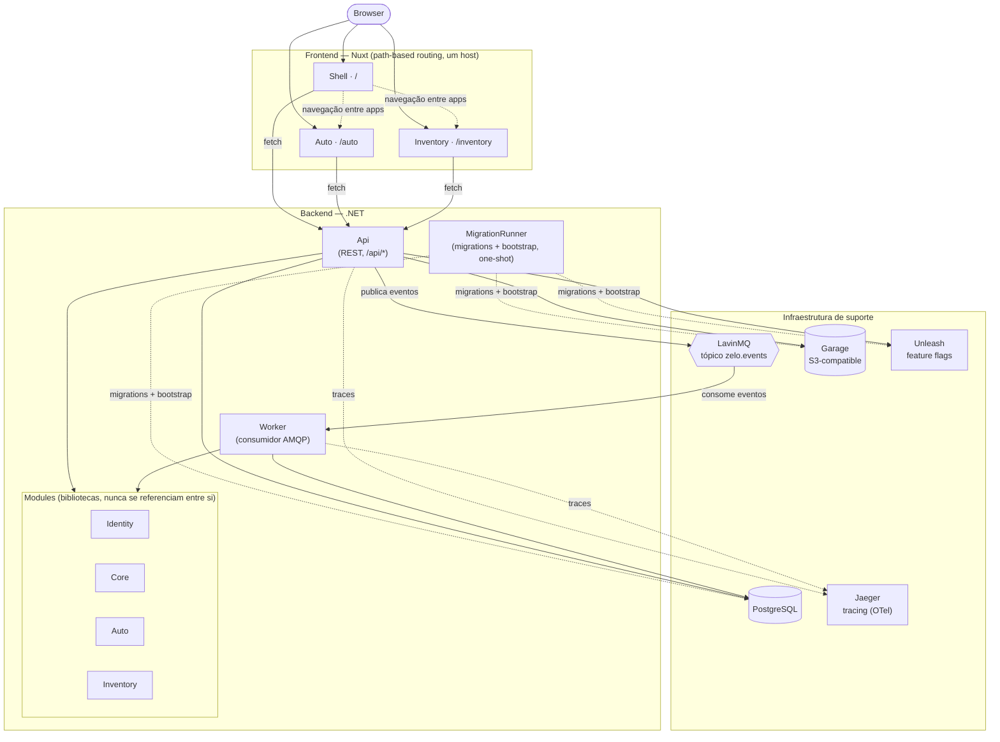

# Zelo

Gestão de ativos pessoais e das obrigações que trazem consigo:
manutenção, seguros, inspeções, garantias, inventário — tudo num só
lugar, com lembretes automáticos das obrigações que vencem.

## Arquitetura

Monólito modular **extraível**: os módulos são bibliotecas com fronteiras
verificadas por testes de arquitetura, carregadas por hosts distintos.
Não são microserviços — mas podem vir a ser, sem reescrita (ver
[`docs/adr/0001-monolito-modular.md`](docs/adr/0001-monolito-modular.md)).

```
backend/src/Hosts/       os únicos executáveis (Api, Worker, MigrationRunner)
backend/src/Modules/     bibliotecas, nunca se referenciam entre si
backend/src/Zelo.Contracts/   a única superfície pública entre módulos
backend/src/Zelo.Messaging/   bus atrás de interface própria (ver ADR-002)
frontend/apps/           apps Nuxt com build/deploy independentes
frontend/packages/       código partilhado entre as apps (UI, cliente da API)
infra/                   Dockerfiles, compose de dev, deploy na Dokploy
docs/adr/                decisões de arquitetura e o porquê de cada uma
```



## Stack

| | |
|---|---|
| Backend | .NET 10, ASP.NET Core minimal APIs, EF Core + PostgreSQL |
| Mensageria | LavinMQ (AMQP), tópico `zelo.events` |
| Armazenamento | Garage (S3-compatible, self-hosted) |
| Feature flags | Unleash (self-hosted) |
| Frontend | Nuxt 4, Vue 3, pnpm workspaces + Turborepo |
| Observabilidade | OpenTelemetry → Jaeger |
| CI/CD | GitHub Actions → GHCR → Dokploy |

## Primeiros passos

Backend:

```bash
cd backend && dotnet restore && dotnet build
```

Frontend (precisa de Node ≥22.12 e pnpm 10 — ver
[`frontend/package.json`](frontend/package.json)):

```bash
cd frontend && pnpm install && pnpm dev
```

Infraestrutura de apoio (Postgres, LavinMQ, Garage, Unleash, Jaeger,
Mailhog) para desenvolvimento local:

```bash
docker compose -f infra/compose/docker-compose.yml up -d
```

Credenciais e portas de cada serviço local:
[`infra/compose/README.md`](infra/compose/README.md).

## Testes

```bash
cd backend && dotnet test
cd frontend && pnpm test
```

## Deploy

CI/CD via GitHub Actions ([`.github/workflows/deploy.yml`](.github/workflows/deploy.yml)):
build → testes → publica imagens no GHCR → dispara deploy na Dokploy —
por serviço, só quando o respetivo caminho muda. `develop` → ambiente de
desenvolvimento, `main` → produção. Detalhes de configuração da Dokploy:
[`infra/compose/README-dokploy.md`](infra/compose/README-dokploy.md).

## Documentação

- [`docs/adr/`](docs/adr/) — decisões de arquitetura (ADRs)
- [`docs/modules/module-contract.md`](docs/modules/module-contract.md) — contrato que cada módulo tem de cumprir

## Licença

Sem licença atribuída — todos os direitos reservados.
