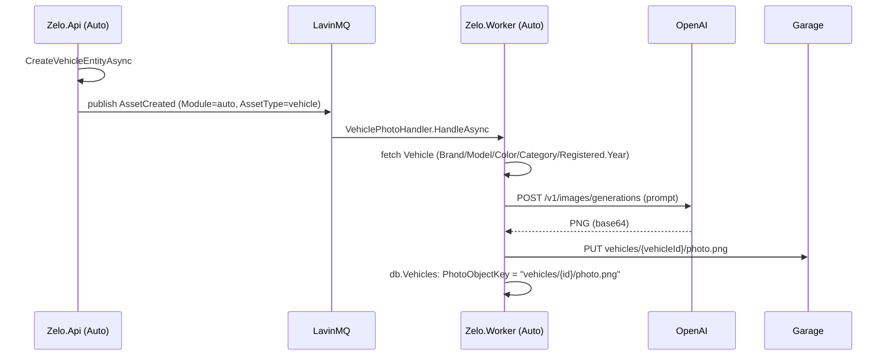

# Plano: geração automática da foto do veículo

> **Estado: implementado** — Vehicle.PhotoObjectKey + migration, VehiclePhotoHandler (consumidor de AssetCreated), IObjectStorage.UploadAsync/CreateReadUrl no Garage, IVehicleImageGenerator + OpenAiVehicleImageGenerator (abstracao pronta para um segundo fornecedor, ex. Nano Banana), VehicleResponse.PhotoUrl e frontend a consumi-lo. Sem redimensionamento server-side (ImageSharp) — VehiclePhoto.vue usa `height: auto`, a proporção nativa do gpt-image-1 (1536x1024) já serve.

## Objetivo

Hoje a foto de um veículo (`VehiclePhoto`, no frontend `auto`) é um PNG
estático em `frontend/apps/auto/public/vehicles/<slug>.png`, um por
modelo (marca+modelo, sem cor), colocado à mão. A maioria dos
modelos não tem imagem — mostra-se um placeholder.

Este plano substitui isso por uma foto gerada automaticamente **por
veículo real** (não por entrada de catálogo), na cor exata desse
veículo, através da API de imagens da OpenAI, disparada
automaticamente quando o veículo é criado.

## Decisões já tomadas (resumo da conversa)

- **Uma imagem por veículo real** (marca + modelo + cor + ano), não uma
  por combinação de catálogo — cada veículo tem sempre a sua própria
  imagem, mesmo que partilhe modelo com outro.
- **Orientado a evento**, não job agendado — reage ao evento já
  publicado na criação do veículo, gera de imediato. Sem sweep
  periódico nesta primeira versão (ver "Fora de âmbito").
- **Fornecedor: OpenAI**, modelo `gpt-image-1` (a API Images normal,
  não a Batch API — batch dava 50% de desconto mas é assíncrona,
  horas de atraso; não compensa ao volume deste projeto).
- **Ano do veículo no prompt** = `Vehicle.Registered.Year` (não há
  campo "ano" próprio, isto é o que já existe). Aceite que o modelo de
  imagem por vezes ignora o ano em nomeplates icónicos (ex. Astra) e
  desenha a geração atual — limitação conhecida do modelo de IA, sem
  mitigação fiável por prompt engineering; a imagem é decorativa, não
  uma ficha técnica.
- **Logótipos de marca ficam fora deste plano** — foi decidido usar
  uma fonte de logos reais, não gerar por IA (risco de imprecisão e de
  marca registada). Pode ser um plano próprio mais tarde; a infra de
  consumo de eventos aqui desenhada serve os dois casos.

## Problema de arquitetura a resolver primeiro

O ficheiro estático em `frontend/apps/auto/public/` é construído para
dentro da imagem Docker do frontend em CI — **o Worker não tem acesso
a esse filesystem em runtime**. Gerar a imagem lá não a põe onde a app
hoje a procura. A imagem tem de passar a ser servida pelo backend.

Isto muda dois pontos do desenho atual:

1. **Armazenamento**: a imagem gerada é guardada no Garage (S3
   compativel), a mesma infraestrutura já usada para os documentos do
   veículo — mas hoje `IObjectStorage` só sabe gerar uma **URL
   pré-assinada de upload** (para o browser fazer o PUT ele próprio).
   O Worker faz o upload ele mesmo, do lado do servidor — precisa de
   um método novo de upload direto.
2. **Serving**: o frontend deixa de pedir `/vehicles/<slug>.png`
   (ficheiro estático) e passa a pedir a imagem ao backend. A forma
   mais simples é o `VehicleResponse` passar a incluir uma
   `PhotoUrl` (nullable) resolvida no momento da resposta, apontando
   para uma URL pré-assinada de **leitura** (GET) com validade curta
   — evita expor o bucket como público.

## Arquitetura proposta



### 1. Novo campo persistente: `Vehicle.PhotoObjectKey`

`string?`, nullable — nulo enquanto a foto não existe/falha a gerar
(o frontend mostra o placeholder de sempre, comportamento inalterado).
Nova migration em `Zelo.Modules.Auto`.

### 2. Evento a consumir: `AssetCreated`, filtrado

Não existe (nem deve existir) um `VehicleCreated` próprio — a criação
do veículo já publica `Zelo.Contracts.AssetCreated` com
`Module="auto"`, `AssetType="vehicle"` (ver `VehicleEvents.Created`).
O handler novo assina esse mesmo evento e descarta em runtime o que
não for dele:

```csharp
internal sealed class VehiclePhotoHandler(
    AutoDbContext db, IVehicleImageGenerator generator, IObjectStorage storage, ILogger<VehiclePhotoHandler> logger)
    : IEventHandler<AssetCreated>
{
    public async Task HandleAsync(AssetCreated @event, CancellationToken ct)
    {
        if (@event.Module != "auto" || @event.AssetType != "vehicle")
            return; // outro modulo (ex. Inventory) publicou o seu proprio AssetCreated

        var vehicle = await db.Vehicles.FindAsync([@event.AssetId], ct);
        if (vehicle is null || vehicle.PhotoObjectKey is not null)
            return; // apagado entretanto, ou (nao deveria acontecer) ja tem foto

        try
        {
            var png = await generator.GenerateVehiclePhotoAsync(vehicle, ct);
            var objectKey = $"vehicles/{vehicle.Id}/photo.png";
            await storage.UploadAsync(objectKey, png, "image/png", ct);

            vehicle.PhotoObjectKey = objectKey;
            await db.SaveChangesAsync(ct);
        }
        catch (Exception ex)
        {
            // Nao volta a tentar sozinho nesta versao - ver "Fora de
            // ambito" (retry/backfill). Falhar aqui nunca deve
            // impedir o resto do fluxo de criacao do veiculo, que ja
            // aconteceu antes deste handler correr.
            logger.LogWarning(ex, "Falha a gerar foto para o veiculo {VehicleId}", vehicle.Id);
        }
    }
}
```

Registado em `AutoModule.AddAutoConsumers`:
```csharp
services.AddZeloEventHandler<AssetCreated, VehiclePhotoHandler>("auto.vehiclephoto");
```

### 3. `IObjectStorage`: novo método de upload direto

```csharp
internal interface IObjectStorage
{
    (Uri UploadUrl, DateTimeOffset ExpiresAt) CreateUploadUrl(string objectKey, string contentType);

    // Novo: o Worker faz o upload ele mesmo (nao e o browser do
    // utilizador) - sem precisar de URL pre-assinada para isto.
    Task UploadAsync(string objectKey, byte[] content, string contentType, CancellationToken ct = default);

    // Novo: o frontend pede a foto atraves da Api, nao diretamente ao
    // Garage - URL de leitura pre-assinada, validade curta.
    Uri CreateReadUrl(string objectKey, TimeSpan validFor);
}
```

`GarageObjectStorage` implementa os dois com `PutObjectAsync` e
`GetPreSignedURL(..., Verb = HttpVerb.GET)` respetivamente — mesmo
padrão que já existe para o PUT.

### 4. `IVehicleImageGenerator` (novo, em `Zelo.Modules.Auto.Infrastructure`)

```csharp
internal interface IVehicleImageGenerator
{
    Task<byte[]> GenerateVehiclePhotoAsync(Vehicle vehicle, CancellationToken ct = default);
}

internal sealed class OpenAiVehicleImageGenerator(HttpClient client, IOptions<OpenAiOptions> options) : IVehicleImageGenerator
{
    public async Task<byte[]> GenerateVehiclePhotoAsync(Vehicle vehicle, CancellationToken ct = default)
    {
        var prompt = VehiclePhotoPrompt.For(vehicle); // ver secção 5
        var response = await client.PostAsJsonAsync("/v1/images/generations", new
        {
            model = "gpt-image-1",
            prompt,
            size = "1536x1024",       // mais proximo do 2.1:1 que o VehiclePhoto usa
            background = "transparent",
            n = 1,
        }, ct);
        response.EnsureSuccessStatusCode();

        var body = await response.Content.ReadFromJsonAsync<OpenAiImageResponse>(ct);
        var base64 = body!.Data[0].B64Json;
        var png = Convert.FromBase64String(base64);

        return ResizeToTarget(png); // 1536x1024 -> ~960x450, ver nota abaixo
    }
}
```

Notas:
- `HttpClient` tipado registado em `AutoModule.AddAutoModule`, com
  `BaseAddress = https://api.openai.com`, `Authorization: Bearer
  {OpenAiOptions.ApiKey}` — mesmo padrão que `IImportRemoteClient`.
- Config nova: `OpenAiOptions.ApiKey`, secção `OpenAi` no
  `appsettings`/env vars (`OpenAi__ApiKey`), mesmo padrão de
  `StorageOptions`/`EmailOptions`. Só o **Worker** precisa disto (a
  Api não gera imagens) — mas `AddAutoModule` é partilhado pelos dois
  hosts, por isso o `HttpClient` fica registado em ambos e
  simplesmente nunca é usado pela Api. Sem custo real nisso.
- Redimensionar 1536×1024 → algo perto de 960×450 (~2,1:1, o que o
  `VehiclePhoto` do frontend espera): recorte central mantendo a
  proporção, com `ImageSharp` (biblioteca a adicionar) — o `gpt-image-1`
  não aceita um `size` arbitrário, só um conjunto fixo.

### 5. Prompts (já validados nesta conversa)

```csharp
internal static class VehiclePhotoPrompt
{
    public static string For(Vehicle vehicle) => vehicle.Category switch
    {
        VehicleCategory.Ligeiros => $"""
            Professional studio product photography of a {vehicle.Registered.Year} {vehicle.Brand} {vehicle.Model} car, {ColorFor(vehicle.Color)} exterior paint.
            Exact side profile view (90-degree lateral shot), vehicle facing right, wheels fully visible.
            Isolated on a plain white background, no surroundings, no reflections of the environment.
            Photorealistic, sharp focus, soft even studio lighting, subtle soft shadow directly beneath the car.
            No text, no watermark, no logos visible, no people.
            Automotive catalog / dealership style, full side silhouette only, not cropped.
            """,
        VehicleCategory.Motociclos => $"""
            Professional studio product photography of a {vehicle.Registered.Year} {vehicle.Brand} {vehicle.Model} motorcycle, {ColorFor(vehicle.Color)} bodywork/tank.
            Exact side profile view (90-degree lateral shot), motorcycle facing right, both wheels fully visible, kickstand hidden or removed digitally.
            Isolated on a plain white background, no surroundings, no reflections of the environment.
            Photorealistic, sharp focus, soft even studio lighting, subtle soft shadow directly beneath the motorcycle.
            No text, no watermark, no logos visible, no people, no riders.
            Automotive catalog / dealership style, full side silhouette only, not cropped.
            """,
        _ => throw new ArgumentOutOfRangeException(nameof(vehicle)),
    };

    // "Cinzento" -> "dark grey (anthracite)", etc. - o modelo responde
    // com mais precisao em ingles; cores fora da lista passam tal e
    // qual (o utilizador pode ja ter escrito em ingles, ou uma cor
    // rara que nao vale a pena mapear).
    private static string ColorFor(string? color) => color is { } c && Map.TryGetValue(c, out var en) ? en : c ?? "factory-standard";

    private static readonly Dictionary<string, string> Map = new(StringComparer.OrdinalIgnoreCase)
    {
        ["Branco"] = "white", ["Preto"] = "black", ["Cinzento"] = "dark grey (anthracite)",
        ["Vermelho"] = "red", ["Azul"] = "blue", ["Verde"] = "green", ["Prateado"] = "silver",
        ["Dourado"] = "gold", ["Bege"] = "beige", ["Castanho"] = "brown", ["Amarelo"] = "yellow",
        // completar com o que aparecer na pratica - lista pequena, facil de estender
    };
}
```

### 6. `VehicleResponse` / REST: expor a foto

```csharp
internal sealed record VehicleResponse(..., string? PhotoUrl) // novo campo no fim
{
    public static VehicleResponse From(Vehicle v, IObjectStorage storage) => new(
        ..., v.PhotoObjectKey is { } key ? storage.CreateReadUrl(key, TimeSpan.FromMinutes(15)).ToString() : null);
}
```

Isto muda a assinatura de `VehicleResponse.From` em todos os call
sites (`GetVehicles`, `GetVehicle`, `CreateVehicleEntityAsync`,
`UpdateVehicleEntityAsync`, `ArchiveVehicleEntityAsync`) para passar a
receber `IObjectStorage` — mecânico, sem lógica nova em cada um.

### 7. Frontend: `photoFor()` deixa de montar um path estático

`useVehicles.ts`, `photoFor(vehicle)` passa a devolver
`vehicle.photoUrl ?? null`, e o `VehiclePhoto` (componente) mostra o
placeholder quando é `null` — mesmo comportamento de fallback que já
existe hoje para o ficheiro em falta, só a fonte do URL muda.
`frontend/apps/auto/public/vehicles/` e o respetivo README deixam de
fazer sentido e podem ser removidos nesta mudança (ou deixados como
está, sem uso, para não misturar limpeza com feature — a decidir na
revisão).

## Testes

- `VehiclePhotoPrompt` — unit tests puros (dado veículo X, prompt
  contém Y), sem precisar de mocks de HTTP.
- `VehiclePhotoHandler` — com `IVehicleImageGenerator` e
  `IObjectStorage` fake (mesmo padrão `FakeEventPublisher` já usado),
  in-memory `AutoDbContext`: gera e grava `PhotoObjectKey`; ignora
  `AssetCreated` de outro módulo; ignora se já tem foto; não propaga
  excepção do gerador (falha "silenciosa", só loga).
- `OpenAiVehicleImageGenerator` — não testar contra a API real; testar
  só a construção do request body e o parsing/redimensionamento da
  resposta com um `HttpMessageHandler` fake.

## Fora de âmbito (a decidir separadamente, não bloqueia isto)

- **Retry de falhas**: se a chamada à OpenAI falhar (rede, rate limit,
  conteúdo rejeitado), o veículo fica sem foto para sempre nesta
  versão — sem job de repescagem. Se isto se tornar um problema
  real, adicionar um endpoint `POST /api/auto/vehicles/{id}/regenerate-photo`
  chamável à mão é mais simples que um sweep agendado.
- **Backfill dos veículos já existentes**: o gatilho é só o evento de
  criação — veículos já existentes na base de dados não ganham foto
  automaticamente. Precisaria de um script/endpoint de execução única
  que republicasse `AssetCreated` (ou chamasse o gerador diretamente)
  para cada veículo sem `PhotoObjectKey`.
- ~~Regenerar ao mudar de cor~~ — **implementado**: 
  `UpdateVehicleEntityAsync` compara `Color` antigo/novo; se mudar,
  apaga `PhotoObjectKey` e republica `AssetCreated` (idempotente nos
  dois consumidores existentes) para o `VehiclePhotoHandler` gerar de
  novo. Não apaga o objeto antigo no Garage (fica órfão) — sem valor
  imediato em resolver isso agora.
- **Logótipos de marca** — fonte real, não IA; mecanismo de consumo de
  evento pode ser o mesmo (`AssetCreated`, ou melhor, o próprio
  `VehiclePhotoHandler` também trata da marca se ainda não tiver
  logo), mas a escolha da fonte concreta (Clearbit por domínio
  adivinhado, Brandfetch, outra) ainda não foi decidida — plano
  próprio quando for para a frente.
- **Custo/quota**: sem limite de gerações por household nesta versão.
  Para um household normal (poucos veículos) o custo é irrelevante;
  se isto vier a ser exposto a mais utilizadores, vale a pena um teto.
